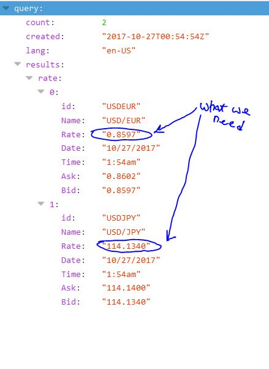

# SIMPLE ONLINE CURRENCY CONVERTER
		
This app is Gets the latest USD Exchange rate from the Yahoo Finance App and Convert it to its Equivalent of EUR, INR, AUD, YEN.

The Yahoo Finance API rate displays all its possible rates.
All you need to do is specify currency(s) like so:

https://query.yahooapis.com/v1/public/yql?q=select%20*%20from%20yahoo.finance.xchange%20where%20pair%20in%20(%22USDEUR%22,%20%22USDJPY%22%20)&format=json&env=store://datatables.org/alltableswithkeys

you get a result like so

